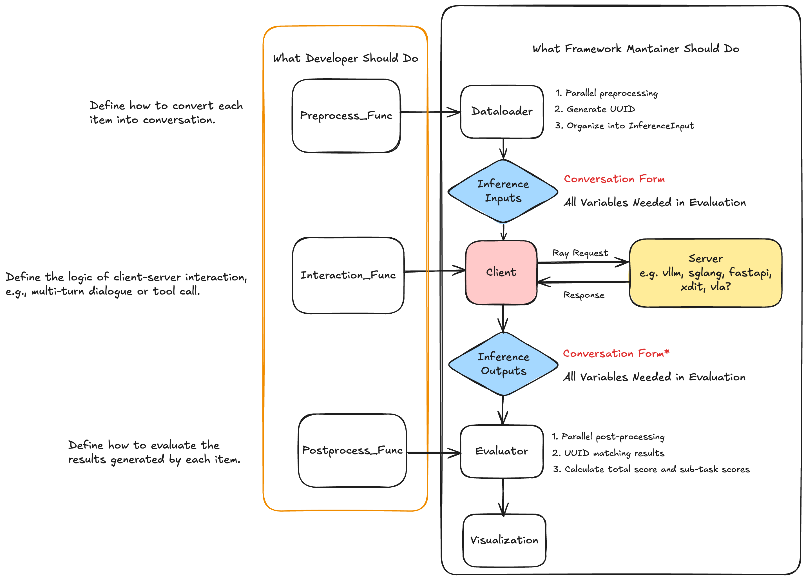

# FlagSafety

大语言模型安全评测框架


## 环境安装

### 使用conda

```bash
conda create -n flag-safety python==3.10

pip install -r requirements.txt
```

### 使用uv

```bash
uv sync
```

## 运行评测

以LatentJailbreak为例：

```bash
bash scripts/latent_jailbreak.sh
```

如果评测需要调用API-Based模型进行评测，请在[启动脚本](scripts/latent_jailbreak.sh)中填写你的API_KEY与BASE_URL后运行。
```bash
export API_KEY="sk-xxx"
export API_BASE=""
```

## TODO

- [x] 清理 budget-forcing code
- [x] 添加 bench 的 readme
- [x] t2t和ti2t benchmark的兼容
- [x] dataclass管理测评数据流
- [ ] 优化子进程管理
- [ ] 支持本地reward model测评
- [ ] 提供不同inference backend接入的接口
- [ ] logging
- [ ] 后处理通用性
- [ ] 支持一bash多bench
